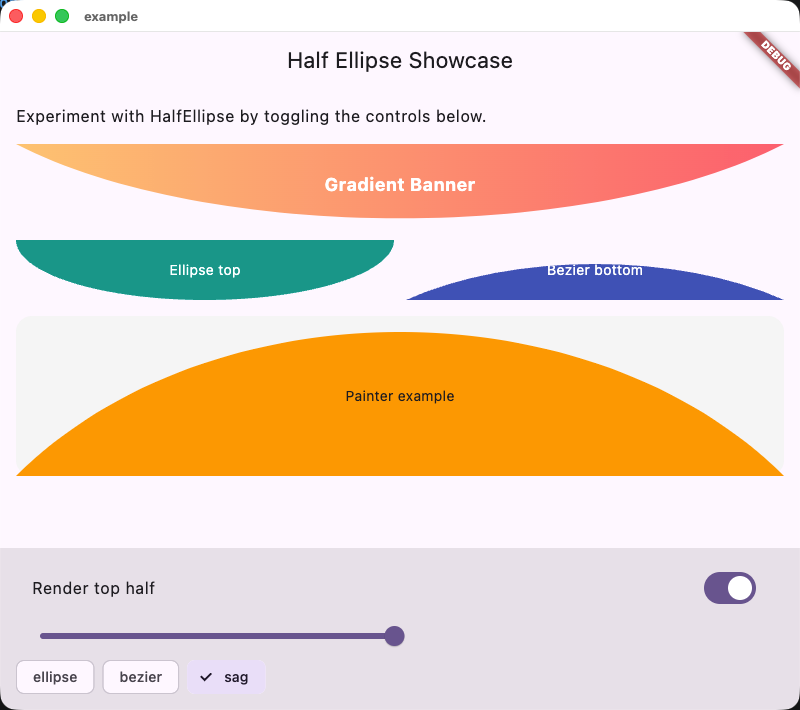

# Half Ellipse 半椭圆容器

English | [中文](#中文)

## Overview

HalfEllipse is a lightweight Flutter widget that clips its child into a customizable half ellipse. It supports solid
colors, gradients, different shapes (ellipse, bezier, sag), and painter access for advanced layouts.

## Getting Started

```dart
HalfEllipse
(
height: 80,
top: true,
shape: HalfEllipseShape.sag,
gradient: const LinearGradient(
colors: [Color(0xFFFFC371), Color(0xFFFF5F6D)],
),
child: const Center(
child: Text('Gradient Banner', style: TextStyle(color: Colors.white)),
),
)
```

See `example/lib/main.dart` for a complete interactive demo.

## Screenshots



---

## 中文

HalfEllipse 是一个 Flutter 半椭圆裁剪容器，支持纯色、渐变、三种弧形模式（ellipse、bezier、sag），也可以通过 `HalfEllipsePainter`
自定义绘制。

## 快速上手

```dart
HalfEllipse
(
height: 80,
top: true,
shape: HalfEllipseShape.sag,
gradient: const LinearGradient(
colors: [Color(0xFFFFC371), Color(0xFFFF5F6D)],
),
child: const Center(
child: Text('渐变标题', style: TextStyle(color: Colors.white)),
),
)
```

更多示例请查看 `example/lib/main.dart` 并运行 `flutter run`。

## 截图


